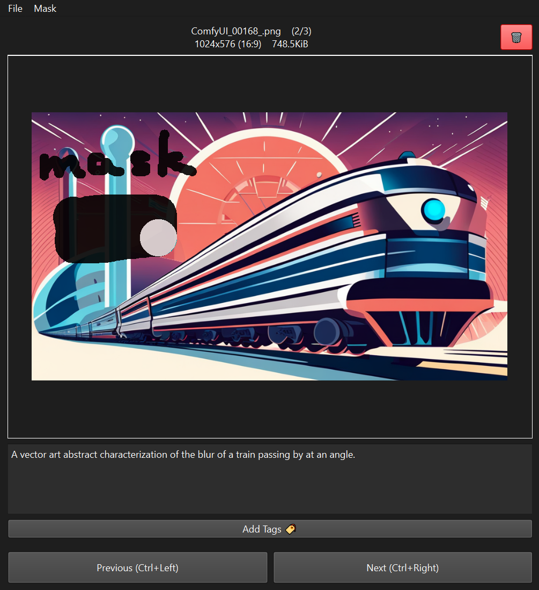

# image data tool

I developed this tool to easily caption, tag, and mask image datasets for finetuning Stable Diffusion.

(for finetuning SDXL with masks, see https://github.com/briansemrau/kohya-ss-sd-scripts/tree/sdxl_lora_mask)



### How to Run

I have written a couple startup scripts that should work right off the bat.

#### Linux/Mac
```bash
run.sh
```

#### Windows
```bat
run.bat
```

### Mask editor

The mask editor supports undo/redo, but the image delete button does not.

Ctrl+Scroll to change brush size
Right-click+Drag to erase.

Everything is autosaved, so be mindful.

### Additional scripts

There are several miscellaneous scripts in [`misc_scripts/`](misc_scripts/) that I also wrote for managing my datasets.

### Development

I do not have plans to support any requested features, but I may be adding features I personally need in the future.
